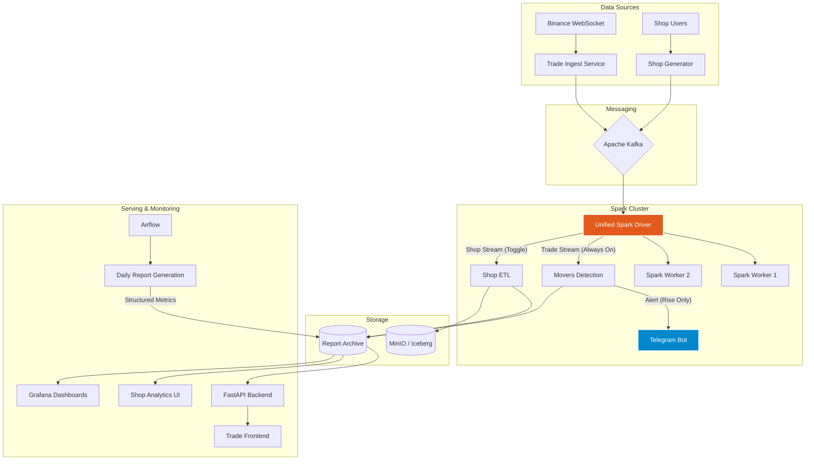

# System Architecture

## Overview
The Junho Data Platform is a high-performance, real-time analytics system processing both Crypto Trade data and Shopping Mall events.
It leverages **Spark Structured Streaming** for low-latency processing and **Airflow** for batch orchestration.



## Deployment & Configuration

### 🔔 Telegram Alerts
Configure credentials in `.env` file at project root:
```env
TELEGRAM_BOT_TOKEN=123456:ABC-DEF...
TELEGRAM_CHAT_ID=123456789
```

### 🎛️ Streaming Modes
Control resource allocation via `docker-compose.yml` or `.env`:
- **Trade Only Mode**: Set `ENABLE_SHOP_STREAMING=false` to dedicate resources to Trade latency.
- **Unified Mode**: Set `ENABLE_SHOP_STREAMING=true` (Data Lake ETL enabled).
