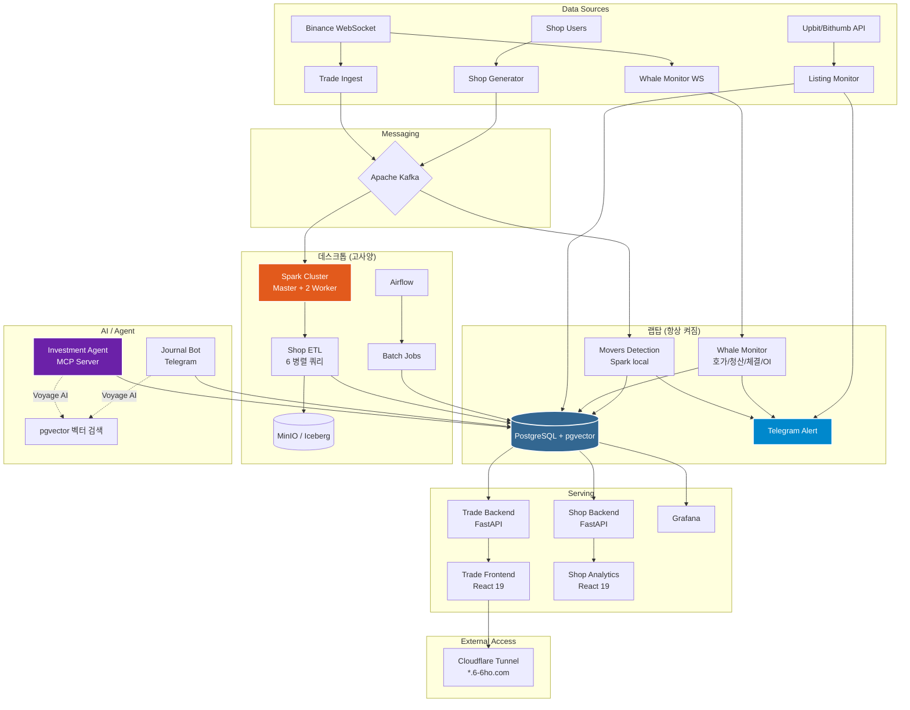

# System Architecture

## Overview
2노드 하이브리드 데이터 플랫폼. Trade(암호화폐 실시간 시그널) + Shop(이커머스 분석) 두 도메인을 데스크톱+랩탑 인프라에서 운영.

## 노드 구성

| 노드 | 역할 | 서비스 수 | 메모리 |
|------|------|----------|--------|
| **랩탑** (항상 켜짐) | Postgres, Kafka, Trade 파이프라인, Whale Monitor, Listing Monitor, Journal Bot, 웹 서빙, Grafana, Tunnel | 16 | ~4G / 8G |
| **데스크톱** (고사양) | Kafka, Spark (Master + 2 Worker), Airflow, MinIO, Shop 전체 | 16 | ~13G / 18G |

## 최근 추가 (2026-03-16 이후)

| 서비스 | 역할 | 노드 |
|--------|------|------|
| whale-monitor | BTC 에피소드 축적형 가격 움직임 분석 (호가/청산/체결/OI/펀딩비) | 랩탑 |
| listing-monitor | 업비트/빗썸 신규 상장 실시간 감지 | 랩탑 |
| investment-agent | MCP 서버 — 투자 기준 CRUD, 메모 벡터 검색, 종목 스크리닝 | 로컬 (MCP) |
| journal-bot | 텔레그램 저널 봇 — 인사이트 메모 수집 | 랩탑 |
| pgvector | PostgreSQL 벡터 검색 확장 | 랩탑 |
